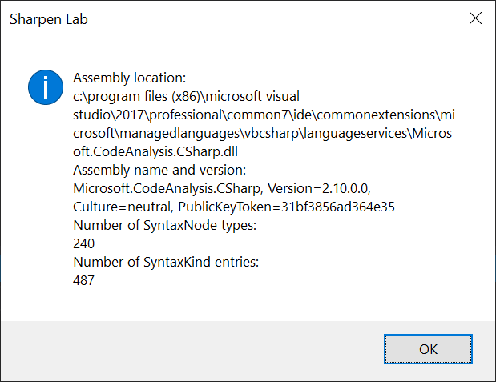

# Roslyn Dependencies at Build and Runtime

## Problem Description

During the development we reference a certain version of the `Microsoft.CodeAnalysis.*` NuGet packages. These are used to build the code and also to run unit tests. But their DLLs are not included in the final VSIX package. The build target that actually creates the VSIX package removes these DLLs.

Roslyn is expressed as prerequisite in the `vsixmanifest` file:

    <Prerequisite Id="Microsoft.VisualStudio.Component.Roslyn.LanguageServices"
                  Version="[15.0.26208.0,17.0)"
                  DisplayName="C# and Visual Basic" />
    <Prerequisite Id="Microsoft.VisualStudio.Component.Roslyn.Compiler"
                  Version="[15.0.26208.0,17.0)"
                  DisplayName="C# and Visual Basic Roslyn compilers" />

This is perfectly fine. At runtime, we want to use the Roslyn version that ships with the Visual Studio.

But practically this means that at the runtime we are bound to a Roslyn version which will very likely not be the one we used for building the Sharpen. Needless to say, this can cause all bunch of issues. In particular, the current version v0.8.0 of Sharpen works fine in both VS2017 and VS2019 just because we use the subset of the API that was not changed between the two corresponding Roslyn versions.

In this experiment we want to confirm this hypothesis (at runtime we are bound to the Roslyn DLLs that ship with the compiler) and find a solution that will enable us to deterministically support both VS2017 and VS2019 (and ideally future version of VS as well) within a single Sharpen VSIX package.

## Running the Experiment

Open `problem\Sharpen.Lab.RoslynDependenciesAtBuildAndRuntime.sln` in VS2017, build it and run unit tests. Then run the extension in the experimental instance of VS2017.

Do the same with VS2019.

## Experiment Results

As assumed, running the unit tests in both VS2017 and VS2019 gives the same output:

As assumed, running the extension in VS2017 gives the following output:

As assumed, running the extension in VS2019 gives the following output:

